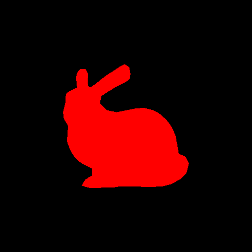
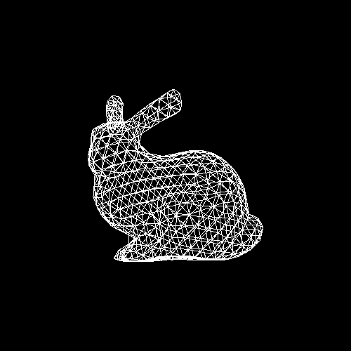
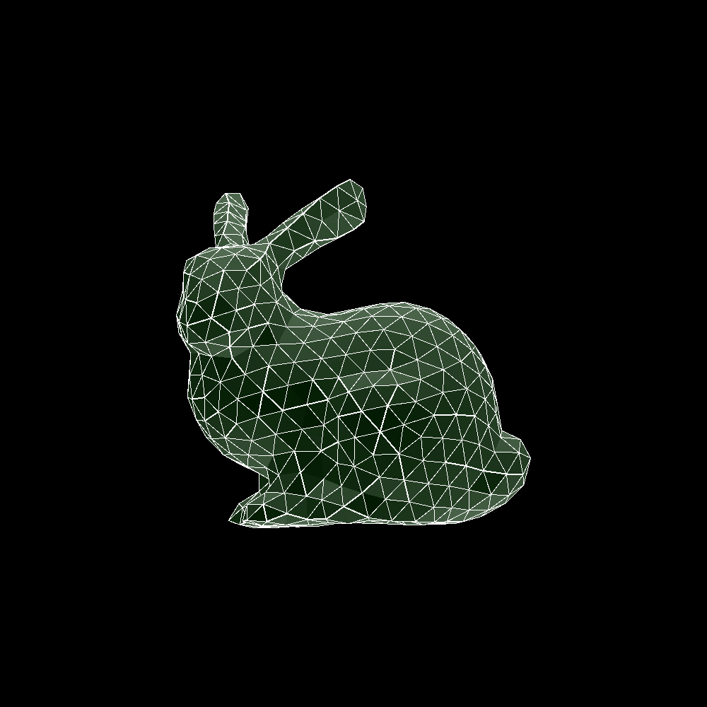
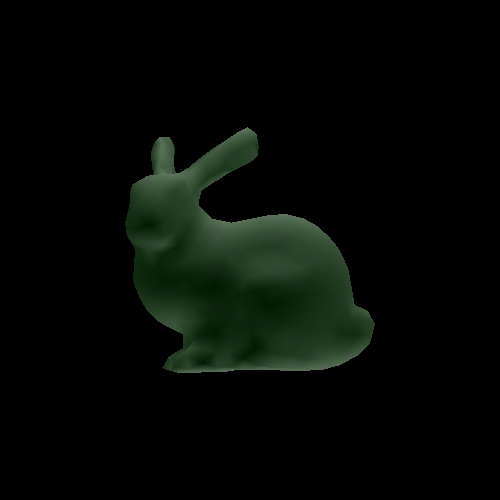
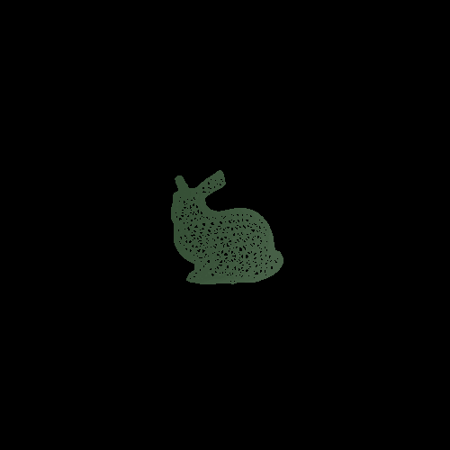

# Operating System
macOS Big Sur Version 11.0.1

# Compiler
Apple clang version 11.0.3 (clang-1103.0.32.62)
Target: x86_64-apple-darwin19.6.0
Thread model: posix
InstalledDir: /Library/Developer/CommandLineTools/usr/bin

# Outputs
## Ex.1. Load and render the silhouette of bunny

## Ex.2.1 Wireframe

## Ex.2.2 Flat shading

## Ex.2.3 Flat shading with Wireframe

## Ex.2.3 Per Vertex

## Ex.3 Animation
